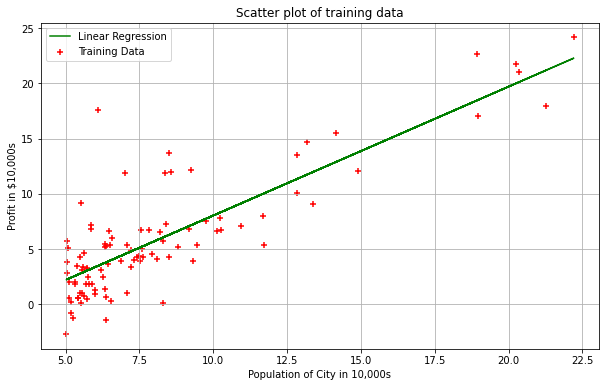
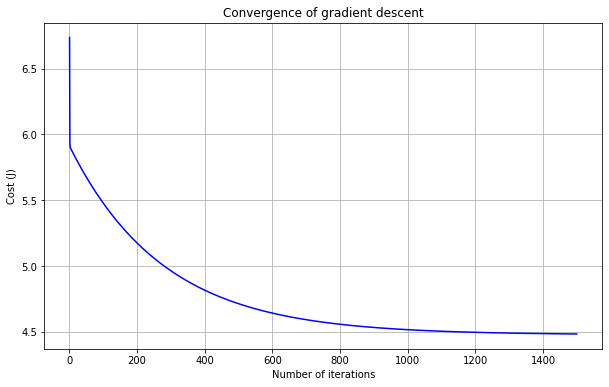

# Python Code


## Notations used
* m   = no of training examples (no of rows of feature matrix)
* n   = no of features (no of columns of feature matrix)
* x's = input variables / independent variables / features
* y's = output variables / dependent variables / target

## Import the required libraries
* numpy : Numpy is the core library for scientific computing in Python. It is used for working with arrays and matrices.
* pandas: Used for data manupulation and analysis
* matplotlib : Its plotting library and we are going to use it for data visualization

```
import numpy as np
import pandas as pd
import matplotlib.pyplot as plt
```

## Load the data
* We are going to use 'profits_and_populations_from_the_cities.csv' csv file
* File contains two columns, the frst column is the population of a city and the second column is the profit of a food truck in that city. A negative value for profit indicates a loss.

```
df = pd.read_csv('https://raw.githubusercontent.com/satishgunjal/Datasets/master/profits_and_populations_from_the_cities.csv')
df.head() # To get first n rows from the dataset default value of n is 5
```


<div>
<style scoped>
    .dataframe tbody tr th:only-of-type {
        vertical-align: middle;
    }

    .dataframe tbody tr th {
        vertical-align: top;
    }

    .dataframe thead th {
        text-align: right;
    }
</style>
<table border="1" class="dataframe">
  <thead>
    <tr style="text-align: right;">
      <th></th>
      <th>population</th>
      <th>profit</th>
    </tr>
  </thead>
  <tbody>
    <tr>
      <th>0</th>
      <td>6.1101</td>
      <td>17.5920</td>
    </tr>
    <tr>
      <th>1</th>
      <td>5.5277</td>
      <td>9.1302</td>
    </tr>
    <tr>
      <th>2</th>
      <td>8.5186</td>
      <td>13.6620</td>
    </tr>
    <tr>
      <th>3</th>
      <td>7.0032</td>
      <td>11.8540</td>
    </tr>
    <tr>
      <th>4</th>
      <td>5.8598</td>
      <td>6.8233</td>
    </tr>
  </tbody>
</table>
</div>


```
X = df.values[:, 0]  # get input values from first column
y = df.values[:, 1]  # get output values from second column
m = len(y) # Number of training examples
print('X = ', X[: 5]) # Show only first 5 records
print('y = ', y[: 5])
print('m = ', m)
```

    X =  [6.1101 5.5277 8.5186 7.0032 5.8598]
    y =  [17.592   9.1302 13.662  11.854   6.8233]
    m =  97
    

## Understand the data
* Population of City in 10,000s and Profit in $10,000s. i.e 10K is multiplier for each data point
* There are total 97 training examples (m= 97 or 97 no of rows)
* There is only one feature (one column of feature and one of label/target/y)

## Data Visualization
* Lets assign the features(independent variables) values to variable X and target(dependent variable) values to variable y
* For this dataset, we can use a scatter plot to visualize the
data, since it has only two properties to plot (profit and population). 
* Many other problems that you will encounter in real life are multi-dimensional and can't be plotted on a 2D plot

```
plt.scatter(X,y, color='red',marker= '+')
plt.grid()
plt.rcParams["figure.figsize"] = (10,6)
plt.xlabel('Population of City in 10,000s')
plt.ylabel('Profit in $10,000s')
plt.title('Scatter plot of training data')
```


    Text(0.5, 1.0, 'Scatter plot of training data')


```
#Lets create a matrix with single column of ones
X_0 = np.ones((m, 1))
X_0[:5]
```


    array([[1.],
           [1.],
           [1.],
           [1.],
           [1.]])


```
# Using reshape function convert X 1D array to 2D array of dimension 97x1
X_1 = X.reshape(m, 1)
X_1[:5]
```


    array([[6.1101],
           [5.5277],
           [8.5186],
           [7.0032],
           [5.8598]])


```
# Lets use hstack() function from numpy to stack X_0 and X_1 horizontally (i.e. column wise) to make a single 2D array. 
# This will be our final X matrix (feature matrix)
X = np.hstack((X_0, X_1))
X[:5]
```


    array([[1.    , 6.1101],
           [1.    , 5.5277],
           [1.    , 8.5186],
           [1.    , 7.0032],
           [1.    , 5.8598]])


Remember to start with we need to initialize the theta parameter with random values. Lets initialize them with 0 values

```
theta = np.zeros(2)
theta
```


    array([0., 0.])


### Now lets write a function to cimpute a cost
* numpy.dot() this function returns the dot product of two arrays. For 2-D vectors, it is the equivalent to matrix multiplication
* numpy.subtract() this function perform the element wise subtraction
* numpy.square() this function perform the element wise square


```
def compute_cost(X, y, theta):
  """
  Compute cost for linear regression.

  Input Parameters
  ----------------
  X : 2D array where each row represent the training example and each column represent the feature ndarray. Dimension(m x n)
      m= number of training examples
      n= number of features (including X_0 column of ones)
  y : 1D array of labels/target value for each traing example. dimension(1 x m)

  theta : 1D array of fitting parameters or weights. Dimension (1 x n)

  Output Parameters
  -----------------
  J : Scalar value.
  """
  predictions = X.dot(theta)
  #print('predictions= ', predictions[:5])
  errors = np.subtract(predictions, y)
  #print('errors= ', errors[:5]) 
  sqrErrors = np.square(errors)
  #print('sqrErrors= ', sqrErrors[:5]) 
  J = 1 / (2 * m) * np.sum(sqrErrors)

  return J
```

```
# Lets compute the cost for theta values
cost = compute_cost(X, y, theta)
print('The cost for given values of theta_0 and theta_1 =', cost)
```

    The cost for given values of theta_0 and theta_1 = 32.072733877455676
    

## Gradient Descent Function
* As of now our compute_cost() function is ready which returns cost for given values of theta
* We will create gradient_descent() function. In this function we are running a loop and for every iteration we are computing the value of theta using batch gradient descent algorithm. And using this value of theta we also computing the 'cost' using cost function and storing it in a list.
* If our algorithm is working properly and givan parameters(alpha and theta) are correct then value of 'cost' should decrease for every step.
* At the end we should get minimum cost value and corresponding theta parameters

```
def gradient_descent(X, y, theta, alpha, iterations):
  """
  Compute cost for linear regression.

  Input Parameters
  ----------------
  X : 2D array where each row represent the training example and each column represent the feature ndarray. Dimension(m x n)
      m= number of training examples
      n= number of features (including X_0 column of ones)
  y : 1D array of labels/target value for each traing example. dimension(m x 1)
  theta : 1D array of fitting parameters or weights. Dimension (1 x n)
  alpha : Learning rate. Scalar value
  iterations: No of iterations. Scalar value. 

  Output Parameters
  -----------------
  theta : Final Value. 1D array of fitting parameters or weights. Dimension (1 x n)
  cost_history: Conatins value of cost for each iteration. 1D array. Dimansion(m x 1)
  """
  cost_history = np.zeros(iterations)

  for i in range(iterations):
    predictions = X.dot(theta)
    #print('predictions= ', predictions[:5])
    errors = np.subtract(predictions, y)
    #print('errors= ', errors[:5])
    sum_delta = (alpha / m) * X.transpose().dot(errors);
    #print('sum_delta= ', sum_delta[:5])
    theta = theta - sum_delta;

    cost_history[i] = compute_cost(X, y, theta)  

  return theta, cost_history
```

Lets update the gradient descent learning parameters alpha and no of iterations

```
theta = [0., 0.]
iterations = 1500;
alpha = 0.01;
```

```
theta, cost_history = gradient_descent(X, y, theta, alpha, iterations)
print('Final value of theta =', theta)
print('cost_history =', cost_history)
```

    Final value of theta = [-3.63029144  1.16636235]
    cost_history = [6.73719046 5.93159357 5.90115471 ... 4.48343473 4.48341145 4.48338826]
    

## Visualization
* Our algorithm returned the final values of theta, and as per our objective these values should give us best fit line
* Lets plot the line using predicted values.
* As per our vector implementation of hypothesis function we will get the predicted values using X*theta. Here theta is the value returned by our Gradient Descent Algorithm

```
# Since X is list of list (feature matrix) lets take values of column of index 1 only
plt.scatter(X[:,1], y, color='red', marker= '+', label= 'Training Data')
plt.plot(X[:,1],X.dot(theta), color='green', label='Linear Regression')

plt.rcParams["figure.figsize"] = (10,6)
plt.grid()
plt.xlabel('Population of City in 10,000s')
plt.ylabel('Profit in $10,000s')
plt.title('Linear Regression Fit')
plt.legend()
```


    <matplotlib.legend.Legend at 0x7f2da121a6a0>





## Convergence of Gradient Descent
* cost_history contains the values of cost for every iteration perfomed during batch gradient descent
* If all our parameters are correct then cost should reduce for every iteration(step)
* lets plot the values of cost against no of iterations to visualize the performance of the Gradient Descent Algorithm

```
plt.plot(range(1, iterations + 1),cost_history, color='blue')
plt.rcParams["figure.figsize"] = (10,6)
plt.grid()
plt.xlabel('Number of iterations')
plt.ylabel('Cost (J)')
plt.title('Convergence of gradient descent')
```


    Text(0.5, 1.0, 'Convergence of gradient descent')





```
predict1 = np.array([1, 3.5]).dot(theta)
print("For population = 35,000, our prediction of profit is", predict1 * 10000)

predict2 = np.array([1, 7]).dot(theta)
print("For population = 70,000, our prediction of profit is", predict2 * 10000)
```

    For population = 35,000, our prediction of profit is 4519.7678677017675
    For population = 70,000, our prediction of profit is 45342.45012944714
    
